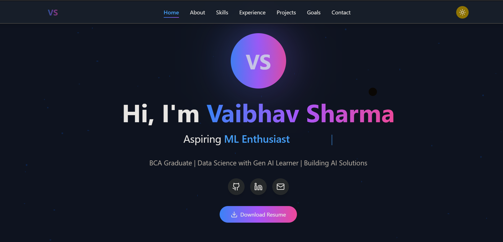
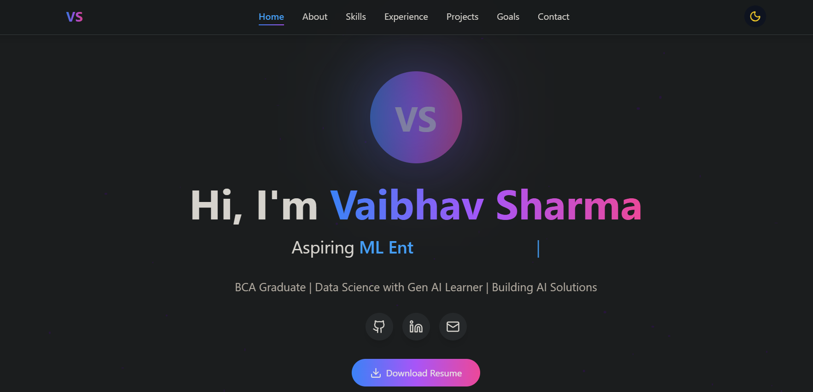

# 🚀 Vaibhav Sharma - Personal Portfolio

A modern, responsive portfolio website showcasing my journey as an aspiring AI Engineer and Data Scientist.


## ✨ Features

- 🌗 **Dark/Light Mode Toggle** - Seamless theme switching
- 🎨 **Modern UI/UX** - Beautiful gradient animations and smooth transitions
- 📱 **Fully Responsive** - Perfect on mobile, tablet, and desktop
- ⚡ **Fast Performance** - Optimized React components
- 🔄 **Dynamic Typing Animation** - Rotating role descriptions
- 🐙 **GitHub Integration** - Auto-fetches latest repositories
- 📧 **Contact Form** - Get in touch easily
- 🎯 **Smooth Scroll Navigation** - Enhanced user experience
- ✨ **Particle Background** - Animated floating particles
- 🎭 **Scroll Reveal Animations** - Sections fade in while scrolling
- 🎨 **Gradient Overlays** - Eye-catching hover effects

## 🛠️ Tech Stack

- **Frontend:** React.js
- **Styling:** Tailwind CSS
- **Icons:** Lucide React
- **Deployment:** Vercel
- **Version Control:** Git & GitHub

## 🎯 Sections

- **Home** - Introduction with animated typing effect
- **About** - Personal background and interests  
- **Challenges & Growth** - Key obstacles overcome in my journey
- **Skills** - Technical expertise categorized by domain
- **Experience** - Work experience and projects
- **GitHub Projects** - Live repository showcase (auto-fetched)
- **Certifications** - Learning achievements
- **Goals** - Short-term and long-term aspirations
- **Contact** - Get in touch with me

## 🚀 Live Demo

🔗 **[View Live Portfolio](https://vaibhav-portfolio.vercel.app)**

## 📸 Screenshots

### Light Mode


### Dark Mode  


### Mobile View


## 💻 Local Development

### Prerequisites

- Node.js (v16 or higher)
- npm or yarn

### Installation

1. Clone the repository
```bash
git clone https://github.com/vaibhavsharma45/portfolio.git
cd portfolio
```

2. Install dependencies
```bash
npm install
```

3. Install Tailwind CSS
```bash
npm install -D tailwindcss@3.3.0 postcss autoprefixer
```

4. Start development server
```bash
npm start
```

5. Open [http://localhost:3000](http://localhost:3000) in your browser

### Build for Production
```bash
npm run build
```

## 📂 Project Structure
```
vaibhav-portfolio/
├── images/              # Screenshots for README
│   ├── light-mode.png
│   ├── dark-mode.png
│   └── mobile-view.png
├── public/
│   ├── index.html
│   └── favicon.ico
├── src/
│   ├── App.js          # Main component with all sections
│   ├── index.js        # Entry point
│   └── index.css       # Tailwind styles
├── package.json
├── tailwind.config.js
├── postcss.config.js
└── README.md
```

## 🎨 Customization

### Update Personal Information

Edit `src/App.js` and modify the following sections:

**GitHub Username (Line ~38):**
```javascript
fetch('https://api.github.com/users/vaibhavsharma45/repos?sort=updated&per_page=6')
```

**Personal Details (Lines ~150-200):**
- Name, title, bio in Hero section
- Skills in `skills` object
- Experience in `experiences` array
- Certifications in `certifications` array
- Goals in `goals` object
- Contact info in Contact section

### Change Theme Colors

Update `tailwind.config.js` to customize color schemes and extend default theme.

## 🌟 Key Features in Detail

### Animations & Effects
- ✨ 50 floating particles in background
- 🖱️ Custom mouse follower with blend mode
- 📜 Intersection Observer for scroll animations
- 🎨 Multi-layer gradient transitions
- 🔄 Transform and scale effects on hover
- 💫 Typewriter effect with role rotation
- ⬆️ Animated scroll-to-top button

### Responsive Design
- 📱 Mobile-first breakpoints
- 💻 Tablet optimizations (md: breakpoint)
- 🖥️ Desktop enhancements (lg: breakpoint)
- 👆 Touch-friendly 48px+ tap targets

### Performance Optimizations
- ⚡ React hooks for efficient rendering
- 🎯 Memoized state updates
- 🔄 Debounced scroll listeners
- 📦 Production build with code splitting

## 🐛 Troubleshooting

### Tailwind CSS not working?
```bash
npm install -D tailwindcss@3.3.0 postcss autoprefixer
```

Ensure `src/index.css` contains:
```css
@tailwind base;
@tailwind components;
@tailwind utilities;
```

### GitHub repos not loading?
- Verify GitHub username in API call (line ~38)
- Check if repositories are public
- Open browser console to check for errors
- Verify internet connection

### Dark mode not persisting?
Currently dark mode doesn't persist on refresh. To add persistence, implement localStorage in the `darkMode` state.

## 📝 Future Enhancements

- [ ] Add blog section with article cards
- [ ] Implement resume PDF download
- [ ] Add project detail pages with case studies
- [ ] Integrate EmailJS for working contact form
- [ ] Add Google Analytics tracking
- [ ] Create CMS for easy content updates
- [ ] Add testimonials/recommendations section
- [ ] Implement i18n for multi-language support
- [ ] Add unit tests with Jest
- [ ] Optimize images with lazy loading

## 🤝 Contributing

Contributions, issues, and feature requests are welcome!

Feel free to check the [issues page](https://github.com/vaibhavsharma45/portfolio/issues).

### How to Contribute

1. Fork the project
2. Create your feature branch (`git checkout -b feature/AmazingFeature`)
3. Commit your changes (`git commit -m 'Add some AmazingFeature'`)
4. Push to the branch (`git push origin feature/AmazingFeature`)
5. Open a Pull Request

## 📄 License

This project is open source and available under the [MIT License](LICENSE).

## 👨‍💻 Author

**Vaibhav Sharma**

Aspiring AI Engineer | Data Science Enthusiast | BCA Graduate

- 🐙 GitHub: [@vaibhavsharma45](https://github.com/vaibhavsharma45)
- 💼 LinkedIn: [Vaibhav Sharma](https://linkedin.com/in/vaibhav-0sharma)
- 📧 Email: [vaibhavsharma95124v@gmail.com](mailto:vaibhavsharma95124v@gmail.com)
- 📊 Kaggle: [@Vaibhavsharma45](https://kaggle.com/Vaibhavsharma45)
- 📱 Phone: +91-9012907709

## 🙏 Acknowledgments

- **React Team** - For the amazing framework
- **Tailwind Labs** - For the utility-first CSS framework
- **Lucide** - For beautiful open-source icons
- **Vercel** - For seamless deployment
- **PW Skills** - For Data Science education
- **GitHub** - For code hosting and collaboration

## 💖 Support

If you found this project helpful or interesting:

- ⭐ Star this repository
- 🍴 Fork it for your own use
- 📢 Share it with others
- 🐛 Report bugs or suggest features

## 📊 Stats


## 📞 Let's Connect!

I'm always excited to connect with fellow developers, AI enthusiasts, and anyone interested in technology!

- 💬 Open to collaboration on AI/ML projects
- 🎓 Happy to discuss Data Science and Gen AI
- 🚀 Available for internship opportunities
- ☕ Always up for tech conversations

---

<div align="center">

### Built with ❤️ and ☕ by Vaibhav Sharma

**"Jo kuch bhi hota hai, ache ke liye hota hai"**

*Whatever happens, happens for good*

---


© 2025 Vaibhav Sharma. All rights reserved.

</div>